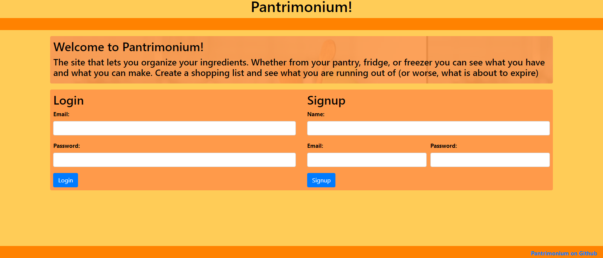
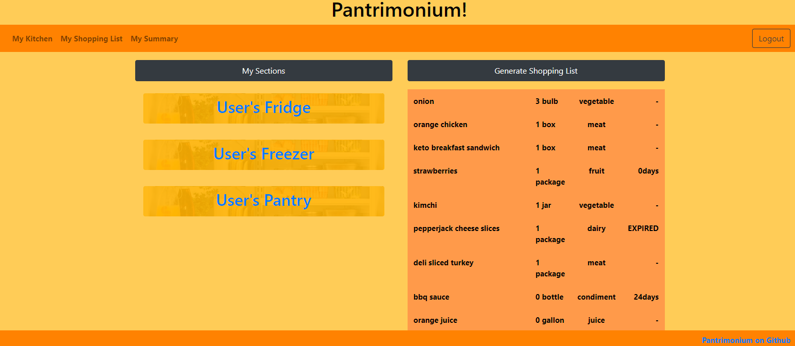
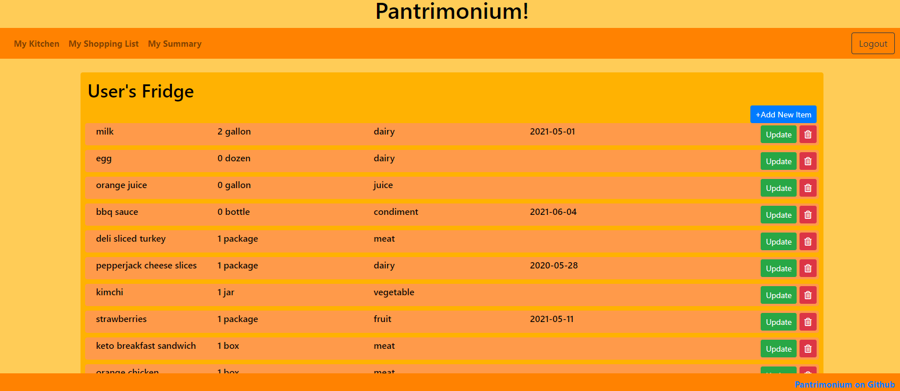
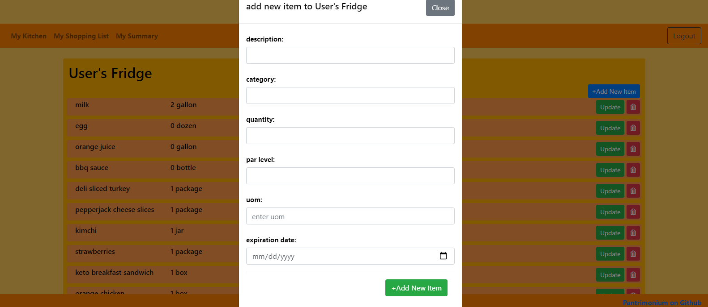
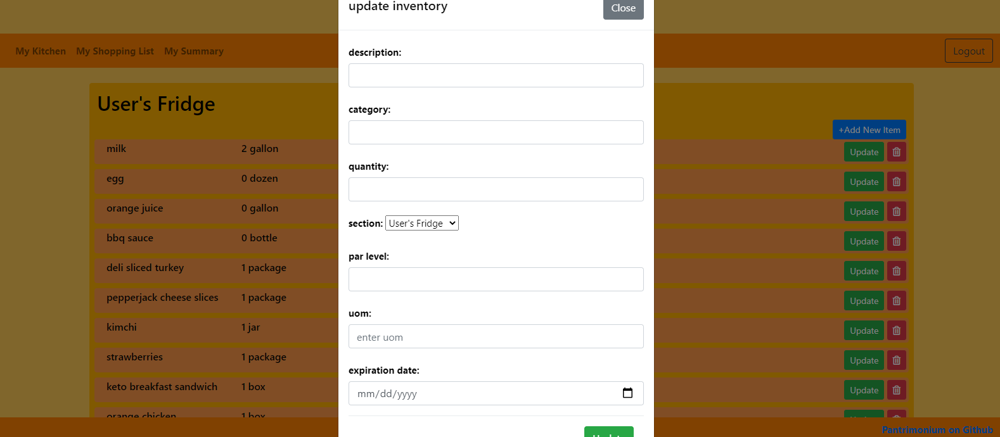
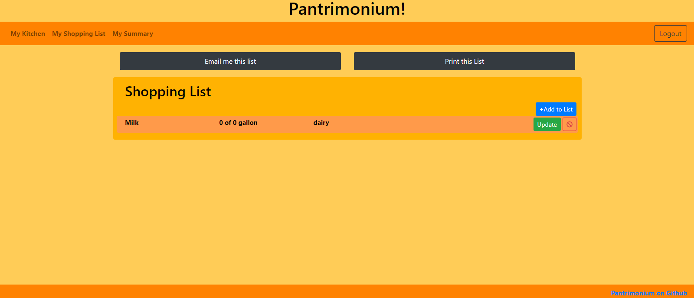
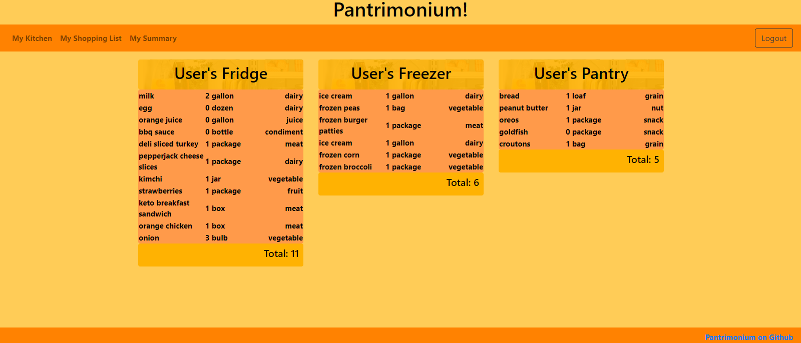

# Pantrimonium

## Table of Contents
1. [Description](#description)
2. [Usage](#usage)
3. [Technologies](#technologies)
4. [Authors](#authors)
5. [Contributing](#contributing)
6. [License](#license)
7. [Questions](#questions) 

## Description
This app allows the user to create an inventory of all food items they have. In the app you can add, view, update, and delete new items. At the same time you can categorize each item and save them in a specific section, such as refrigerator, freezer, or pantry. There is a generated shopping list where items running low or expiring are located and the user can also add, and delete items on that page.

## Usage
[Click this link to check out our deployed application!](https://pantrimonium.herokuapp.com/)

- The client will be able to sign up and create a user, once logged in they will be presented with their personal sections. The user mobile version is versatile and user friendly on any mobile or tablet.

- Once logged in the client will have access to 3 sections of inventory, in which they will be able to add new items and edit them as well.

- You will be able to navigate from each page directly from your nav bar (My Kitchen, My Shopping List, and My Summary)

- The client will be able to go into each individual section and add new items as well as update them

- When an item is running low or expiring the item will be added to the shopping list

- When you are in the shopping list page the client will have the option to email or print the shopping list

- Below the email and print buttons the shopping list will be provided with the option to delete or update any items, as well as adding new ones to the list

- My summary page will contain all your sections with items and total items of your entire inventory. The user will be able to easily identify the total number of items at the bottom of each table and see what items are held in those sections.

- There will be a log out button located on the top-right hand side for the client to be able to logout at any point

## Technologies
Front End: 
* ExpressJS / Express-Handlebars

Back End: 
* NodeJS
* MySQL
* bcrypt
* express-session
* sequelize

API:

## Authors
| Name | GitHub  |
| :--: | :-----: | 
| Rick Rocero |  |
| Robert Adams |  |
| Angelica Cereceres |  |
| Sung Kim |  |

## Contributing
Fork the git repository then contact the repository owner about pull requests. 

## License
This project is covered under the [MIT](https://opensource.org/licenses/MIT) license.

## Questions
For questions, contact [Rick](https://github.com/rickrocero) or email me at rickrocero@gmail.com.